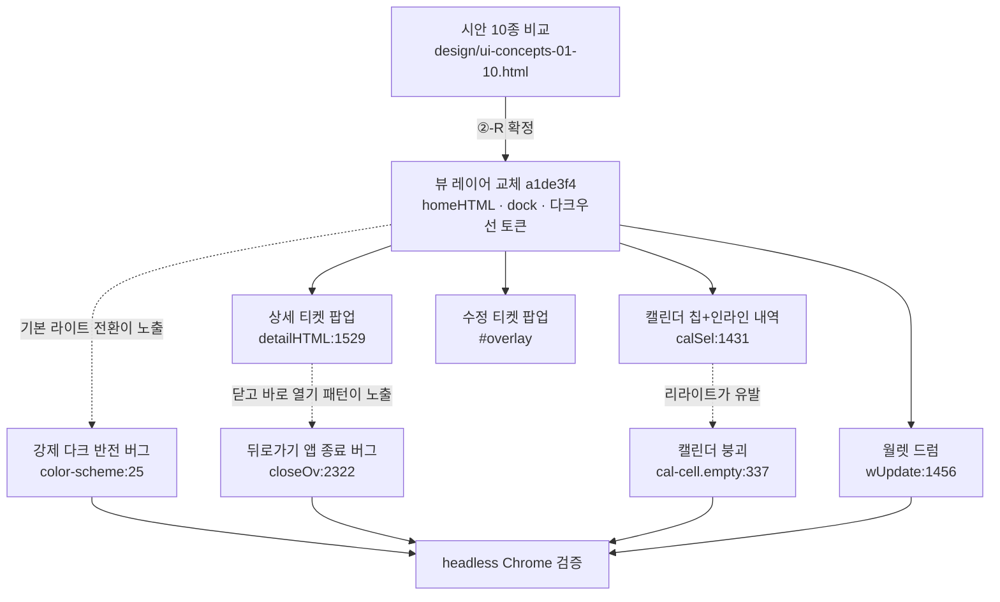
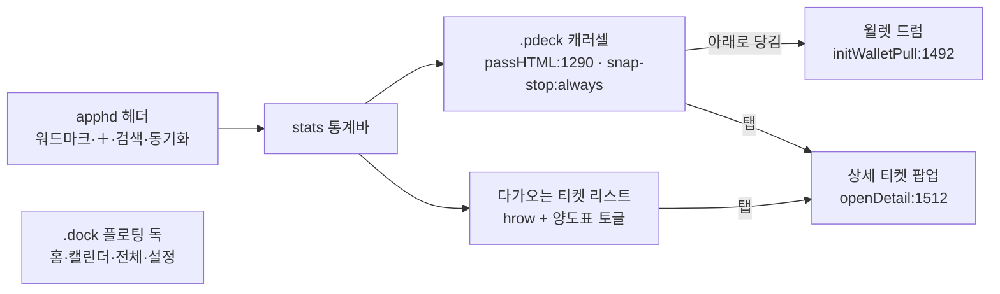
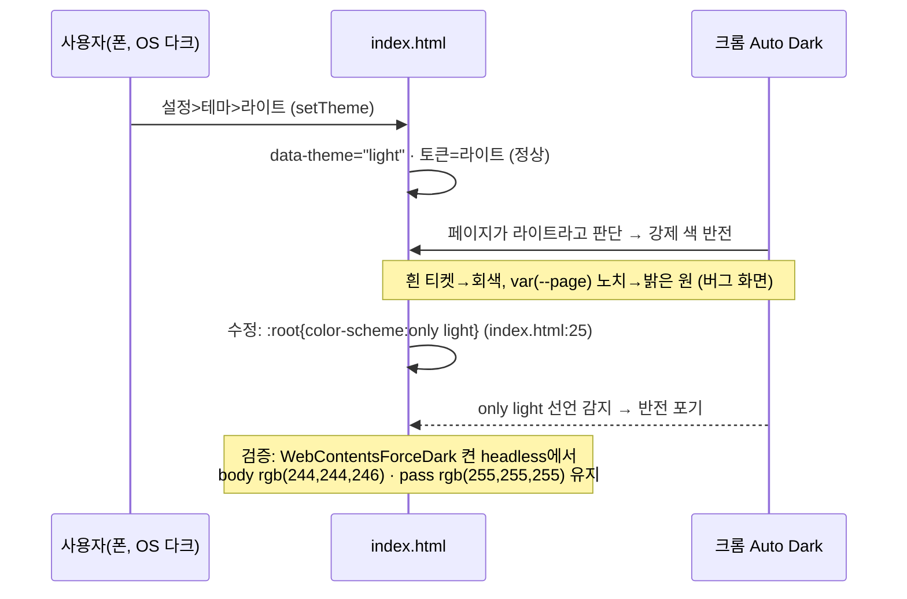
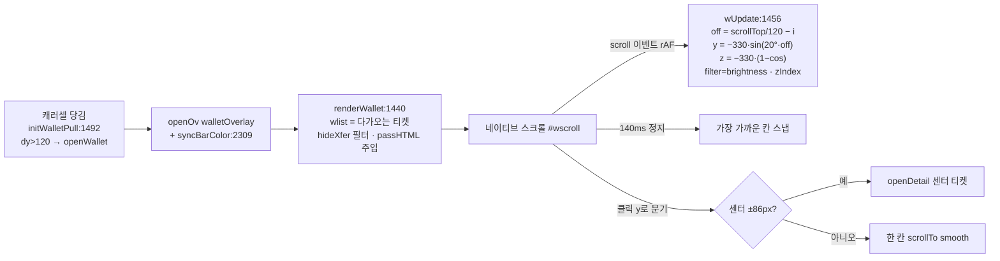

# 작업기록: UI 전면 리디자인 "티켓 패스" — 2026-07-14 ~ 2026-07-15

> 대상: `index.html`(단일 파일 PWA) · 커밋 범위 `a1de3f4..8bc266d`(21개) + 시안·아이콘 커밋(`64661ba`, `40e72f5` 포함)
> 배포: GitHub Pages 자동(푸시 즉시) · 검증: headless Chrome(playwright-core, 모바일 뷰포트 390×844) 스크린샷

**한 줄 요약**: 화이트+블루 카드 UI를 "실물 티켓 패스" 언어(흰 종이 티켓 · 절취선 · 노치 · 플로팅 독)로 전면 교체하고, 그 과정에서 드러난 강제 다크 모드 반전·히스토리 뒤로가기 앱 종료 등 구조 버그를 수정했다.

---

## 0. TL;DR

| # | 스레드 | 문제/목표 | 근본원인·핵심 결정 | 조치 | 결과 커밋 |
|---|---|---|---|---|---|
| 1 | 시안 선정 | 기존 UI 불만, 새 틀 필요 | 시안 ①~⑩ 중 "②-R 티켓 패스+플로팅 독" 확정 | 시안 `design/`에 보관 | `64661ba` |
| 2 | 뷰 레이어 교체 | 홈 신설·내비 재편 | 홈=히어로 패스+리스트, 독=홈·캘린더·전체·설정 | `homeHTML`/`dock`/토큰 교체 | `a1de3f4` |
| 3 | 상세 티켓 팝업 | "아이템 같다" 반복 지적 | 세로 보딩패스 + 불투명 스크림 = 진짜 펀치 노치 | `detailHTML` 3회 재설계 | `cb4f973`→`0995096` |
| 4 | 수정 팝업 | 바텀시트 이질감 | 티켓 종이 팝업 + sticky 저장줄 + 사진 메뉴 | `#overlay` 티켓화 | `be78e54`, `69d00dc` |
| 5 | 라이트모드 버그 | 라이트 선택해도 어둡게 | **브라우저 Auto Dark가 라이트 페이지를 반전** | `color-scheme:only light` | `b844001` |
| 6 | 캘린더 | 팝업→인라인, 못생김, 붕괴 | 붕괴=전역 `.empty` 패딩 누수 | 칩 스타일 + `calSel` 인라인 | `87fa365`, `40e72f5`, `ce6ecfd`, `8bc266d` |
| 7 | 뒤로가기 앱 종료 | 수정에서 back=앱 꺼짐 | `history.back()`+`pushState` 경합 | 고아 항목 소비 방식 재설계 | `69d00dc` |
| 8 | 월렛 드럼 | 다가오는 티켓 모아보기 | 계단 스택→원통 드럼→**서 있는 계단식 원통** | `wUpdate` sin/cos 궤적 | `69d00dc`→`4af721c` |
| 9 | 공유카드·아이콘 | 티켓답게 | 캔버스 티켓 패스 + 세로 보딩패스 아이콘 4종 | `composeInfoCard` 재작성 | `87fa365`, `40e72f5` |
| 10 | 양도차익 표기 | "받은돈−구매금" 요구 | 상세 표기만 변경(회계 `ticketAcct`는 유지) | `detailHTML` net 계산 | `c7159b9` |

### 전체 흐름



**바로가기**: [1. 시안 선정](#1-시안-선정과-확정-틀) · [2. 뷰 레이어 교체](#2-뷰-레이어-교체-홈티켓-패스--플로팅-독) · [3. 상세 티켓](#3-상세-팝업-세로-종이-티켓으로-3회-재설계) · [4. 수정 팝업](#4-수정-팝업-티켓-종이화) · [5. 라이트모드](#5-라이트모드가-어둡게-보이던-버그-브라우저-강제-다크) · [6. 캘린더](#6-캘린더-인라인-내역칩-스타일붕괴-수정) · [7. 뒤로가기](#7-뒤로가기-한-번에-앱이-꺼지던-버그-히스토리-경합) · [8. 월렛 드럼](#8-월렛-드럼-계단-스택--원통--서-있는-계단식-원통) · [9. 공유카드·아이콘](#9-공유카드와-앱-아이콘) · [10. 양도차익](#10-양도차익-표기-기준) · [11. 검증 방법](#11-검증-방법-headless-chrome) · [12. 남은 일](#12-남은-일과-유의사항)

**용어 정의**(문서 전체 공통): **패스(pass)** = 홈 캐러셀의 가로 티켓 카드(`passHTML:1290`), **티켓 팝업(tkt)** = 상세의 세로 보딩패스(`detailHTML:1529`), **드럼** = 월렛 모아보기 원통 뷰, **독(dock)** = 하단 플로팅 내비.

---

## 1. 시안 선정과 확정 틀

- 📋 **작업**: 기존 화이트+블루 UI 전면 재검토. 시안 ①티켓지갑 ②박스오피스 ③전광판 ④조종석 ⑤라인업포스터 ⑥라이브패스 ⑦시즌프로그램 ⑧스트리밍홈 ⑨브리핑 ⑩다이어리 10종 제작·비교.
- 🔍 **발견**: 사용자는 ②의 UI 골격(와이드 히어로+리스트)을 선호하되 극장 용어(NOW SHOWING 등)는 거부, ①의 실물 티켓 모양(절취선·노치·바코드)을 히어로에 결합 요구. 하단 버튼은 전부 플로팅, + 버튼 불필요(티켓은 캡처 공유→AI 인식으로 유입).
- 💡 **사실**: 확정 틀 = **"②-R": 다크/라이트 캔버스 위 흰 티켓 패스 + 가운데 플로팅 독**. 티켓은 테마와 무관하게 항상 흰 종이(앱의 시각 언어 핵심).
- 🔧 **액션**: 시안 원본을 저장소에 보관 — `design/ui-concepts-01-10.html`(①~⑩), `design/ui-final-ticket-dock.html`(확정안), `design/ui-ticket-wallet.*`(과거 킵안).
- ✅ **결과물**: 커밋 `64661ba`. 이후 모든 구현·개선의 기준 문서.

## 2. 뷰 레이어 교체: 홈(티켓 패스) + 플로팅 독

- 📋 **작업**: 확정 틀을 `index.html`에 구현. 회계(`ticketAcct:1025`)·스와이프(`initCalSwipe`)·시그니처 dedup 등 내부 로직은 불변.
- 🔧 **액션** (커밋 `a1de3f4`, 이후 보강):
  - **홈 뷰 신설** `homeHTML:1311` — 히어로 = 다가오는 공연 패스 캐러셀(`.pdeck:245`, 완전 양도 제외) + "다가오는 티켓" 리스트(전체 포함, `e431d99`에서 히어로 제외 로직 삭제 — 부분취소 항목 누락 원인이었음) + 양도표 표시/숨김 칩(`toggleHideXfer:1309`, `localStorage tm_hidexfer`).
  - **플로팅 독** `.dock:370` — 홈·캘린더·전체·설정. 상단 세그먼트·FAB 스피드다이얼·⚙️ 제거. `SWIPE_VIEWS=['home','calendar','list']`(타일 뷰·핀치 배율은 `0995096`에서 폐지).
  - **헤더** — 워드마크 + ＋(추가 시트) + 🔍(검색 토글) + 동기화 점.
  - **토큰 교체** — 라이트 `#f4f4f6`/카드 흰색, 다크 `#0d0e12`/카드 `#17181d`, 포인트 `#2E63F0`.
  - **깜빡임 방지 확장** — 홈도 캘린더처럼 시그니처 dedup(`_homeSig`, 구 `_upSig`/#upnext 폐기).
- ✅ **결과물**: 홈이 기본 화면. `ARCHITECTURE.md`의 전역 상태·dedup 항목 갱신.

### 홈 화면 구조



## 3. 상세 팝업: 세로 종이 티켓으로 3회 재설계

- 📋 **작업**: 아이템 탭 → 수정 폼 직행이던 것을 "티켓표" 상세로. 사용자 피드백 3라운드: ①"티켓 같지 않고 아이템 같다" ②"절취선만 흉내내지 말고 outlook 완벽하게" ③"노치 원색과 배경색이 달라 부자연, 예매처는 하단좌측, 버튼은 하단우측 잉크블랙, 바코드는 무의미하니 삭제, 상단 라운드 금지".
- 🔍 **발견**: 반투명 스크림(rgba) 위에 고정색 원으로 노치를 흉내내면 blend 색이 달라져 "가짜"가 티남.
- 💡 **사실**: **스크림을 완전 불투명 단색(`#detailOverlay{background:#0e0f13}`: 272)으로 만들면 노치 원(`.tkt-perf::before/::after` 동일색)이 배경과 정확히 붙어 진짜 뚫린 구멍이 된다.**
- 🔧 **액션** (`detailHTML:1529`, CSS `.tkt:274` 블록):
  - 최종 구조: 예매처색 상단 스트립(각진 모서리) → 공연명 → **날짜·시간·디데이 3열 모노 블록** → 절취선(+펀치 노치) → 좌석별 상태(취소/양도+수령액 태그) → 매수·가격·양도수령·양도차익 그리드 → 차익 수식 줄 → 절취선 → **메모 스텁**(+일련번호 `ticketNo`) → 하단 푸터(좌: 스와치+예매처 / 우: 수정·공유·예매내역 잉크 아이콘) → 톱니 절단면(`.tkt-zig`, conic-gradient).
  - 양도완료 = 회전 스탬프(`.dt-stamp`).
- ✅ **결과물**: `cb4f973` → `b006d63` → `0995096`. 렌더 스크린샷으로 노치·스탬프·3열 블록 확인(스크린샷 미보존, 세션 스크래치에만 존재).

## 4. 수정 팝업: 티켓 종이화

- 📋 **작업**: 수정 화면도 티켓 언어로 — 바텀시트 폐지, 군더더기 제거.
- 🔧 **액션** (`be78e54`, `69d00dc`):
  - `#overlay`를 `centered` 티켓 팝업으로(각진 종이, 폭 352px, 주변 검은 스크림). **테마와 무관하게 흰 종이** — 시트 스코프에서 라이트 토큰 재선언(`#overlay .sheet{--card:#fff; ...}`)으로 내부 모든 컨트롤이 자동 라이트.
  - 상단 스트립 색 = 선택한 예매처 색(`syncVendorBtn`이 `#modalBand` 갱신).
  - **취소/저장 = sticky 하단 고정** + 절취선(`#overlay .save-row{position:sticky;bottom:0}`).
  - 사진 아이콘 1개 → 메뉴(`openPhotoMenu:1921`): 보기 / 교체·등록(`editImgUpload:1932` — `fileToB64` 후 `tickets.update({img, seats.hasImg:true})`) / **삭제 신설**(`deleteTicketImg:1948` — `img:null, hasImg:false`).
  - 상세→수정은 **겹쳐 열기**(닫고 열면 §7 히스토리 경합). 저장 시 아래 깔린 상세 갱신, 삭제 시 상세도 닫음(`save()`/`del()` 내부).
- ✅ **결과물**: 렌더로 스크롤 중에도 저장줄 고정 확인.

## 5. 라이트모드가 어둡게 보이던 버그: 브라우저 강제 다크

- 📋 **작업**: "라이트 선택해도 다크로 나온다"(스크린샷 증빙: 테마 세그=라이트인데 화면 어두움, 흰 티켓이 회색 반전).
- 🔍 **발견**: headless 검증에선 `data-theme=light`, `body bg=rgb(244,244,246)`로 정상 → 앱 로직 문제 아님. 스크린샷의 색 반전 패턴(흰 카드→어두운 회색, 노치→밝은 원)이 결정적 단서.
- 💡 **사실**: **안드로이드 크롬/삼성인터넷의 Auto Dark(강제 다크 모드)가 "라이트로 선언된 페이지"를 브라우저 차원에서 반전**시킨 것. 예전엔 기본 테마가 auto(폰 다크=앱 다크)라 반전 대상이 없어 잠복해 있다가, 기본을 라이트로 바꾸자(`b006d63`) 드러남.
- 🔧 **액션** (`b844001`): 표준 옵트아웃 선언 —
  ```css
  /* index.html:25 */
  :root{ color-scheme:only light; ... }
  :root[data-theme="dark"]{ color-scheme:dark; ... }
  ```
  + `<meta id="metaScheme" name="color-scheme">`를 테마 전환 시 동적 갱신(`applyTheme`).
- ✅ **결과물**: **강제 다크를 켠 크롬**(`--enable-features=WebContentsForceDark --force-dark-mode`) + OS 다크 + 테마 라이트 조합으로 재현 검증 → `body bg=rgb(244,244,246)`, `pass bg=rgb(255,255,255)` 반전 없음.

### 인과 사슬 (버그 재현 → 수정 검증)



## 6. 캘린더: 인라인 내역·칩 스타일·붕괴 수정

- 📋 **작업**: ①날짜 탭=팝업 대신 아래 인라인 내역(가계부 앱 스크린샷 참고) ②"못생김" → 칩 스타일 ③리라이트 후 "개박살" 복구 ④다가올 공연 강조 → 3회 시도 끝에 **제거**.
- 🔍 **발견**(③): 첫 주 셀들이 세로로 폭발. 원인 추적: 캘린더 자리채움 셀 `.cal-cell.empty`와 **전역 빈 상태 `.empty{padding:52px 20px}`가 클래스명 충돌** — 과거에 padding 재정의로 막아뒀던 것을 리라이트하면서 삭제했었음.
- 🔧 **액션**:
  - 인라인 내역: `calOpen`(centered 팝업) 삭제 → `calSel:1431`(selDay 토글) + `renderCalendar`가 선택일 리스트를 카드 하단에 렌더. 기본 선택=오늘.
  - 칩 스타일(`40e72f5`): 셀 테두리 제거, 라운드 칩(`--chip`), 일정=accent-soft 틴트, 오늘=잉크 원 숫자, 선택=잉크 링.
  - 붕괴 차단(`ce6ecfd`): `.cal-cell.empty{...;padding:0}`(`index.html:337`) + 주석으로 재발 방지 명시.
  - 다가올 공연 강조: 진한 채움(`40e72f5`) → "답답" → 그라데이션+글로우 맥동(`4fd9862`) → "outlook과 안 맞음" → 미니 흰 티켓(`1c6ef57`) → "별로" → **전면 제거**(`8bc266d`). 다가오는 공연 강조는 홈 히어로·드럼이 전담.
- ✅ **결과물**: 렌더 스크린샷으로 칩 그리드+오늘 원+인라인 내역 확인.

| 다가올 공연 강조 시도 | 커밋 | 사용자 반응 |
|---|---|---|
| 진한 블루 채움 + 숨쉬기 | `40e72f5` | "임팩트 없음, 답답" |
| 그라데이션 칩 + 글로우 맥동 + 확대 | `4fd9862` | "임팩트는 좋은데 outlook과 안 맞음" |
| 미니 흰 티켓(블루 밴드+섀도우) | `1c6ef57` | "별로" |
| **제거(일정 틴트만)** | `8bc266d` | 확정 |

## 7. 뒤로가기 한 번에 앱이 꺼지던 버그: 히스토리 경합

- 📋 **작업**: "수정 화면에서 뒤로가기하면 앱이 꺼짐".
- 🔍 **발견**: headless에서도 재현 — 팝업을 코드로 닫은 직후 다른 팝업을 열면(`closeOv`→`history.back()` 직후 `openOv`→`pushState`) 페이지가 `about:blank`로 이탈(전역 함수 소실로 확인).
- 💡 **사실**: `history.back()`은 **비동기**라서, back 내비게이션이 진행되는 동안 실행된 `pushState`와 경합해 히스토리 스택이 꼬인다. 롱프레스 메뉴→수정, 금액상세→수정 등 "닫고 바로 열기" 경로 전부가 잠재 지뢰였음.
- 🔧 **액션** (`69d00dc`, `index.html:2308-2340`): 프로그램적 닫기에서 `history.back()` 호출을 **완전 제거**. 닫힌 팝업의 잔여 히스토리 항목은 `_orphan` 카운터로 세어뒀다가 뒤로가기(popstate) 때 조용히 소비:
  ```js
  // closeOv:2322 — back() 없이 시각적 닫기 + 고아 적립
  _ovStack.splice(idx,1); _orphan++;
  // popstate:2331 — 항상 [팝업 닫기 → 고아 소비 → (그 다음에야) 앱 종료] 순서
  if(_ovStack.length){ ...최상단 닫기... } else if(_orphan>0){ _orphan--; }
  ```
  부수 정리: 상세→수정/공유는 닫지 않고 **겹쳐 열기**(`detailEdit`/`detailShare`).
- ✅ **결과물**: 겹침 스택에서 페이지 생존 확인(`page alive after edit-over-detail = true`). 트레이드오프: 팝업을 UI로 닫은 만큼 뒤로가기가 1회 무동작(고아 소비)일 수 있으나 앱이 꺼지는 일은 구조적으로 불가능.

```mermaid
sequenceDiagram
  participant UI as UI(탭)
  participant OV as openOv/closeOv
  participant H as 브라우저 히스토리
  rect rgb(80,30,30)
  Note over OV,H: (수정 전) 경합 시나리오
  UI->>OV: closeOv(A)
  OV->>H: history.back() (비동기 시작)
  UI->>OV: openOv(B)
  OV->>H: pushState (back 진행 중에 실행)
  H-->>UI: 스택 꼬임 → 다음 back에서 앱 이탈
  end
  rect rgb(25,60,35)
  Note over OV,H: (수정 후) back() 미사용
  UI->>OV: closeOv(A)
  OV->>OV: _orphan++ (항목은 그대로 둠)
  UI->>OV: openOv(B) → pushState (경합 없음)
  UI->>H: 사용자가 뒤로가기
  H->>OV: popstate → B 닫기 → (다음 back) 고아 소비 → (그 다음) 종료
  end
```



## 8. 월렛 드럼: 계단 스택 → 원통 → 서 있는 계단식 원통

- 📋 **작업**: 홈 캐러셀을 아래로 쓸어내리면 애플월렛처럼 티켓을 모아보는 화면. 이후 "iOS 날짜 피커처럼 원통을 굴리는 느낌, 단 카드는 세로로 서 있게"로 구체화.
- 🔍 **발견**(반복 이슈):
  1. 쓸어내리기가 **브라우저 당겨서-새로고침**에 먹힘.
  2. 겹침 스택에서 양도표에 `opacity`를 주자 **아래 카드가 비쳐** 지저분.
  3. 원통 1차 구현이 **1.5배 확대**되어 보임 — `rotateX+translateZ(+R)`만 쓰면 센터 카드가 카메라 쪽으로 R만큼 나와 perspective 확대가 걸림.
- 💡 **사실**:
  - PTR 차단은 `overscroll-behavior`(`index.html:50`) + 대상 요소 `touch-action:pan-x`(`.pdeck:245`) + JS `preventDefault` 3중이 필요.
  - 겹치는 불투명 카드의 원근 dim은 **opacity가 아니라 brightness**로.
  - 원통은 카드 회전 없이 **궤적만** 적용 가능: `y=-R·sin(θ)`, `z=-R·(1-cos(θ))` — 카드는 정면으로 서 있고 멀수록 간격이 줄며 뒤로 물러나는 "계단식 원통"이 됨(사용자 최종 요구와 일치).
- 🔧 **액션** (`index.html:1436-1508`):
  - 구조: 투명 네이티브 스크롤 드라이버(`#wscroll`, 관성 공짜) + 절대배치 스테이지(`#wstage`). 스크롤 → `wUpdate:1456`가 각 카드 transform 계산.
  - 상수 `W_ITEM=120, W_ANG=20, W_R=330`(:1436) — 상하 폭·간격 튜닝 지점.
  - 관성 멈춤 후 **칸 스냅**(scroll 140ms 무이벤트 → 가장 가까운 칸으로 smooth), **센터 탭=상세 / 위·아래 탭=한 칸 굴림**(`initWalletDrum:1474`).
  - 진입: 캐러셀 당김 제스처(`initWalletPull:1492`) — 손가락 따라 최대 64px 고무줄(계수 0.38), 임계 120px에서 진동+오픈, 미달 시 스프링 복귀. 포커스 지점은 화면 정중앙(-36px 보정, `4af721c`).
  - 양도표 = 흑백(`filter grayscale`) + **양도완료 스탬프**(`passHTML`에 내장, `f3f0088`) + 헤더 토글(`#wXf`).
  - edge-to-edge: 어두운 전면 오버레이 열림 시 상태바 색 동기화 — `DARK_OVS:2308`/`syncBarColor:2309`가 `theme-color` 메타를 `#0e0f13`로 스왑, 닫히면 `applyTheme()` 복귀.
- ✅ **결과물**: `69d00dc`→`c7159b9`→`c4b7eb7`→`9d43eb4`→`c4d78e2`→`f3f0088`→`4af721c`. 렌더 스크린샷으로 계단식 원통·스탬프·센터 정중앙 확인.

### 드럼 렌더 파이프라인



## 9. 공유카드와 앱 아이콘

- 📋 **작업**: 공유 이미지·앱 아이콘도 티켓 언어로 통일.
- 🔧 **액션**:
  - **공유 정보카드** `composeInfoCard:2161`(`87fa365`) — 캔버스에 실물 티켓 패스를 그림: 연회색 바탕 위 흰 라운드 티켓, 예매처 색점+D-day 칩, 절취선+양쪽 노치, 좌석/매수·가격, **id 시드 결정적 바코드**, 양도완료면 회전 스탬프. (§3에서 상세 팝업의 바코드는 삭제했지만 공유카드는 이미지 한 장의 완성도를 위해 유지 — 상세와 달리 "가짜 노치" 문제가 없음: 바탕색을 캔버스가 직접 그리므로 정확히 일치.)
  - **앱 아이콘**(`40e72f5`, PowerShell System.Drawing 생성 스크립트) — 딥 다크 배경 + 기울어진 **세로 보딩패스**(블루 밴드·절취선·노치·바코드) 4종(180/192/512/maskable-512). 후보 3안(블루 그라데이션 가로 / 다크 가로 / 다크 세로) 중 상세 티켓과 정체성이 같은 세로안 채택. `sw.js` 캐시 `tm-shell-v4`로 셸 갱신.
- ✅ **결과물**: 아이콘 PNG 커밋, manifest `theme_color/background_color=#f4f4f6`.

## 10. 양도차익 표기 기준

- 📋 **작업**: 상세 팝업의 양도 금액이 "그냥 수령액만 나온다" → **받은 돈 − 티켓 구매금액**으로.
- 💡 **사실**: 회계 모델(`ticketAcct:1025`)의 양도차익은 "수령액 − 양도한 좌석의 원가"로 통계·실지출과 정합. **상세 팝업 표기만** 사용자 직관(수령 − 전체 구매금)으로 분리하기로 결정 — 통계까지 바꾸면 관람 좌석 원가가 실지출과 이중 계산됨.
- 🔧 **액션** (`c7159b9`, `detailHTML` 내):
  ```js
  const net=recv-(Number(t.price)||0);            // 표시용: 받은돈 − 구매금액
  ...양도차익 셀 = signMoney(net)
  ...수식 줄 = `차익 계산: 받은 ₩${won(recv)} − 구매 ₩${won(t.price)}`
  ```
- ✅ **결과물**: 예) 흠뻑쇼 나구역(3매 ₩570,700, 2석 양도 ₩374,000 수령) → 상세 표기 **−₩196,700**, 통계 기준은 −₩6,467(양도 2석 원가 기준). **두 값이 다른 것은 의도된 이원화**임을 유지보수 시 유의.

부수 확인: "싸이 흠뻑쇼 8/1 부분양도가 사라졌다" 신고 → Supabase 직접 조회로 **데이터 무손실 확인**(가구역 4매 전체양도 `a0e506c2`, 나구역 3매 부분양도 `23a74ed0`). 원인은 홈 리스트가 히어로 티켓을 제외하던 표시 로직(`e431d99`에서 삭제)과 완전 양도 dim.

## 11. 검증 방법: headless Chrome

- 도구: `playwright-core` + 로컬 Chrome(`C:/Program Files/Google/Chrome/Application/chrome.exe`), `python -m http.server`로 서빙, 뷰포트 390×844 · DPR 2 · 터치 에뮬레이션.
- 스크립트(세션 스크래치, 저장소 미포함): shot.js(전 뷰) / shot2.js(**강제 다크 플래그** 검증) / shot3~4(상세·수정 팝업) / shot5~7(월렛·드럼·캘린더).
- 확인 항목 예: `data-theme`/`body` 배경색 계산값, 강제 다크 하 흰 티켓 유지, 겹침 스택 페이지 생존, sticky 저장줄, 드럼 확대 버그.
- 한계: `history.back()` 타이밍은 headless와 실기기 거동이 달라 실기기 확인 병행 필요. 인라인 스크립트 문법은 매 커밋 전 `new Function` 파싱 체크(ARCHITECTURE.md 체크리스트).

## 12. 남은 일과 유의사항

| 항목 | 상태 | 메모 |
|---|---|---|
| 공유카드를 세로 티켓으로 재통일 | 미착수 | 현재 가로 패스형. 상세(세로)와 톤 차이 |
| 양도차익 이원화(§10) | 의도됨 | 통계 기준 변경 요청 오면 `ticketAcct` 한 곳만 수정 |
| `_orphan` 잔여 항목 | 트레이드오프 | UI로 닫은 팝업 수만큼 뒤로가기 1회 무동작 가능 |
| 드럼 튜닝 | 상수화 | `W_ITEM/W_ANG/W_R`(:1436)와 포커스 오프셋 36px(CSS `.wdrum`) |
| 캘린더 다가올 공연 강조 | 제거 확정 | 재도입 시 §6 실패 이력 참고(채움·글로우·미니티켓 모두 기각) |
| PWA 캐시 | 주의 | 셸 갱신 시 `sw.js` CACHE 버전 올릴 것(현재 v4) |
